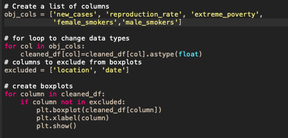
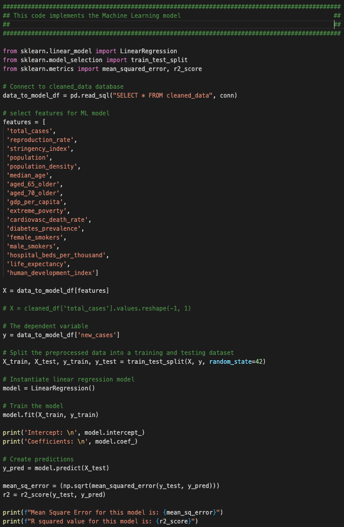

# dataviz-final-project-group4
Final project for the McCombs Data and Visualization Bootcamp

## Project
### Topic: COVID-19 Data Analysis/Modeling to Predict New Cases across countries
### Reason for topic selection: Vast number of data sources/data points available.
### Description of the source of data: https://github.com/CSSEGISandData/COVID-19
### Questions hoping to be answered with the data: 
- To analyze impact of covid on economy (some relationship between covid cases vs GDP)
- To analyze relationship between underlying health conditions and deaths
- Predict new cases

### Description of the communication protocols: 
Slack, Team meetings every other day.

## Overview
The purpose of this project is to implement end to end data pipeline and finally analyze and model the data using ML techniques.

### Exploratory Data Analysis
The main python file used for dataset preperation and cleaning can be located   [HERE](https://github.com/maraisabella/dataviz-final-project-group4/blob/main/dataviz_fp_gp4_covid_analysis.py)

We identified columns had significant missing data and removed them. For example, total vaccinations were missing the majority of the data. 
We then removed cases that had missing values. In addition, we created boxplots to identify those variables with outliers using the script below. 

### Machine Learning Model
The provisional machine learning model we have used is Linear Regression to predict new Covid cases based on the following features:

features = [
 'total_cases',
 'reproduction_rate',
 'stringency_index',
 'population',
 'population_density',
 'median_age',
 'aged_65_older',
 'aged_70_older',
 'gdp_per_capita',
 'extreme_poverty',
 'cardiovasc_death_rate',
 'diabetes_prevalence',
 'female_smokers',
 'male_smokers',
 'hospital_beds_per_thousand',
 'life_expectancy',
 'human_development_index']

#### Screenshot of ML code:

Mean Square Error for this model is: 5124.77880420126
R squared value for this model is: 0.6944965902211448

### Database Integration
SQLite is the database we intend to use for the initial analysis.

We intend to use Python, Pandas functions and methods, and SQLAlchemy to filter out the columns in the table from the covid.sqlite database to retrive all the data for each country.

SQLite is selected in the initial phase of the project as it is easy to setup. It is a file-based relational database that uses SQL as its query language. Being file-based tremendously simplifies deployment, making it very good for the case where an application needs a little database but must be run in an environment where having a database server would be problematic.

We created a SQLite dabase "covid.sqlite" in the folder database. This database is created by importing the cleaned data from the CSV file "owid-covid-data.csv".

### Data Visualization

