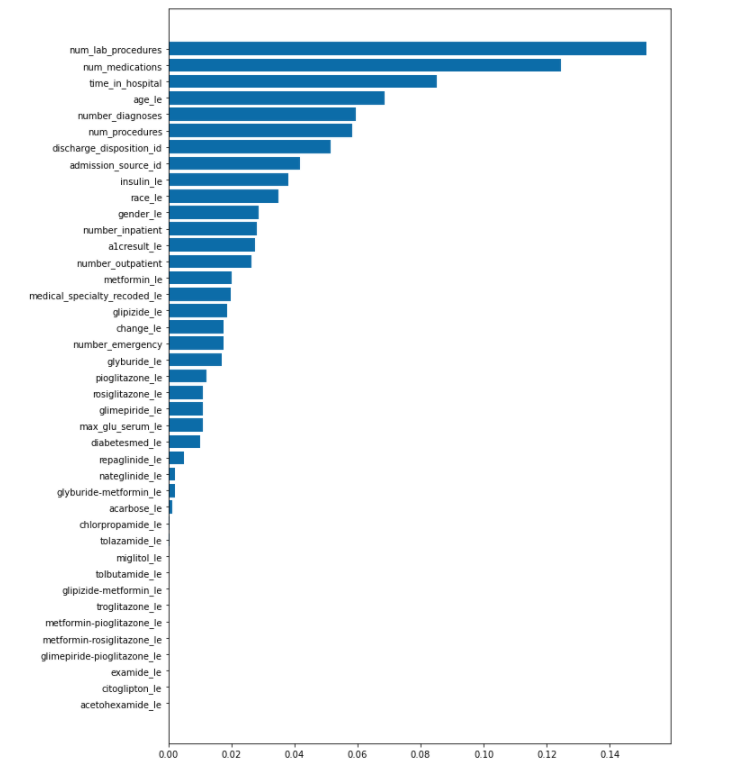
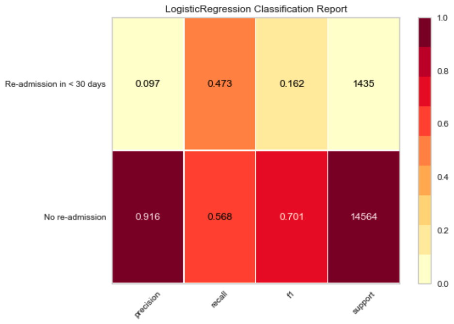

# Data Visualization Final Project - Team 4
- Final project for the McCombs Data and Visualization Bootcamp

## Project
### Topic: Prediction of early readmission for hospitalized patients with diabetes using data collected from electronic medical records.
### Reason for topic selection:
- According to diabetes.org, patients with diabetes are 2 times higher risk for heart disease and 4 times higher risk for stroke and suffer from other costly complications including foot problems such as gangrene, eye problems such as Diabetic retinopathy, diabetic macular edema, cataract and glaucoma, diabetic kidney disease requiring dialysis, and teeth and gum problems.
- Diabetes.org estimates an average medical expenditure for people with diagnosed diabetes at $13,700 per year, ($7,900 attributed to diabetes) with 327 billion total cost of diagnosed in 2017 and 237 billion in direct medical costs, 90 billion in reduced productivity.
- National Library of Medicine and NIH report that nearly 20% of all Medicare discharges had a readmission within 30 days with readmissions associating with unfavorable patient outcomes and high financial costs 
- Medicare payment advisory commission (MedPAC) estimated that 12% of readmissions are potentially avoidable. 

### Description of the source of data: 
- This study uses the Health Facts database (Cerner Corporation, Kansas City, MO), a national data warehouse that collects comprehensive clinical records across hospitals throughout the United States. 
- The Health Facts database is comprised of data collected from 130 hospitals and integrated delivery systems throughout the United States that use the Cerner Corporation electronic medical records representing 10 years (1999 – 2008) of clinical care.
- The database includes encounter data, provider specialty, demographics, diagnoses and in-hospital procedures documented by ICD-9-cm codes, laboratory data, pharmacy data, in-hospital mortality, and hospital characteristics.
- All data was de-identified in compliance with HIPPA before being provided to researchers and continuity of patient encounters was preserved.
- Initial dataset is available at the website of Data Mining and Biomedical Informatics Lab at VCU (http://www.cioslab.vcu.edu/).

### Questions hoping to be answered with the data: 
- To analyze the clinical data and predict early readmission (within 30 days) of diabetic patients
- Is there a signfiicant difference between patietns hospitalized with diabetes that have been readmitted within 30 days vs those not readmitted within 30 days, and if so, on what dimensions do they differ. 

### Description of the communication protocols: 
- In order to enhance our communication in the most effective manner, we will be communicating via Slack for project updates. We will also be conducting team Zoom meetings every day. With both of these methods being used for our project, they are both equally crucial because we will be notifying each other of changes made to code and coordinating with each other before changes are pushed, pulled, and merged on GitHub.

## Overview
The purpose of this project is to deterine if a model could be created that would significantly predict early readmissions (defined as less than 30 days from discharge) using logistic regression. 

## Exploratory Data Analysis
- The preliminary dataset contained 69,710 records
- 63.57% of patients discharged were discharged to home
    - The next highest discharge disposition category was discharged/transferred to SNF at a distant 12.6%

- 53.25% of admissions came from Trauma Center followed by emergency department

- Roughly ~75% of cases were caucasian followed by 18% for African American

- 53% cases were female, 47% male 

- ~81% of cases above age 50

- average time in hospital slightly longer (4.78 days) for those readmitted less than 30 days vs those not readmitted (4.21 days)

- 91% of cases did not have a readmission within 30 days resuting in a significantly unbalanced dataset

## Machine Learning Model
We started with Logistic Regression model to predict the binary outcome of whether the patient will be re-admitted within 30 days or not.
We applied a tree model and a random forrest model as well after several adjustments to the logistic regression model. 

### Data Pre-Processing

The Initial dataset was created in two steps (prior to download):
1. Encounters of interest were extracted from database with 55 attributes
2. Preliminary analysis and preprocessing of data were performed resulting in retaining attributes and encounters that could be used for further analysis using the following inclusion criteria
    - Inpatient encounters (hospital admission)
    - Diabetic encounter in which any kind of diabetes was entered into the system as a diagnosis
    - Length of stay was at least 1 day and no more than 14 days
    - Lab tests were performed during the encounter
    - Medications were administered during the encounter
- Original dataset contained incomplete and redundant information. Several features with high missing values include:
    - Weight – excluded from dataset
    - Payer code – excluded from dataset
    - Medical specialty – included in dataset

### Preliminary Feature Engineering

- Several variables modified using one hot encoding and dummy coding
- Data was resampled to address imbalance in early readmissions
- Data was scaled to improve model performance 
- Feature importance was run with  RandomForestClassifier that ranks the features by their importance:

 

### Description of Data Splitting
- Data were split using the sklearn model selection module to split the dataset into training and testing datasets. The training dataset comprised of 70% of the original dataset while the testing set contained 30% of the dataset. For data splitting we used the following code snippet:

Our cleaned dataframe contains a total of 69710 rows. Doing simple math we can see that there is a 75-25 split between train set and test set respectively.

The provisional machine learning model we have used is Logistic Regression to predict patient readmission based on the following features:

features = ['race',
 'gender',
 'age',
 'medical_specialty',
 'diag_1',
 'diag_2',
 'diag_3',
 'max_glu_serum',
 'A1Cresult',
 'metformin',
 'repaglinide',
 'nateglinide',
 'chlorpropamide',
 'glimepiride',
 'acetohexamide',
 'glipizide',
 'glyburide',
 'tolbutamide',
 'pioglitazone',
 'rosiglitazone',
 'acarbose',
 'miglitol',
 'troglitazone',
 'tolazamide',
 'examide',
 'citoglipton',
 'insulin',
 'glyburide-metformin',
 'glipizide-metformin',
 'glimepiride-pioglitazone',
 'metformin-rosiglitazone',
 'metformin-pioglitazone',
 'change',
 'diabetesMed']

### Explanation of Model Choice:
Our label or outcome is a prediction of whether a patient will be readmitted within 30 days or not so it is naturally a classification problem. 

#### Benefits
Logistic Regression is our initial choice as it is a binary classifier that fits our data and easy to implement.

#### Limitations
While accuracy score seems to be impressive i.e. we are achieving 91% of accureacy score with this model:

But when we look at the classification report, we can see that it fails to predict "No" readmissions:

Both "recall" and "f1 score" for predicting "No" readmissions is 0 which means the model is very poor and cannot be a good fit for this dataset. We clearly will have explore our data more and test other ML algorithms.

#### Undersampled Data
Counter output on target variable clearly reveals that our data is undersampled:

#### Explanation of Improvement in Sampling and Model
Due to the imbalance in data we first tried RandomUnderSampling but it didn't improve the precision and recall significantly. Then we tried SMOTE and Edited Nearest Neighbors (ENN) or SMOTEENN. We tried different classifiers 'Logistic Regression','Random Forest Classifier','Decision Tree' and 'Balanced Random Fores Classifier' as shown below along with their respective confusion matrices, accuracy scores and classification reports:

#### Model Selected
We can see from the above scores that Random Forest Classifier reasonably fits the model as f1 score, recall and precision have significantly improved for the prediction of  <30 day re-admmission cases. 

## Database Integration

- **pgAdmin/PostgreSQL** is the database we used for segment 2 analysis.

- We are connecting to the postgresSQL database and accessing the data in the python file using the "psycopg2" and "sqlalchemy".

- **'diabetes_raw_data'** table is created in the postgresSQL database to hold all the raw data. The raw data is imported from the csv file - diabetic_data_initial.csv.

- The raw data from the postgresSQL table 'diabetes_raw_data' is read into dataframe - diabetes_raw_data_df.

- After the data cleaning procedure is completed, the cleaned data in the dataframe diabetes_raw_data_df is written to a new table **'diabetes_clean_data'**. The new table 'diabetes_clean_data' is created while copying the data from dataframe into sql.

- Multiple other tables are created from 'diabetes_clean_data' table in the database.sql file.

- The tables are : Patient, Admission, Diagnosis and Medicines.

- Following is the snapshots of **ERD** used:

     

- **Schema** can be found in *database/diabetes_schema.txt*.

- Inner join is performed from Patient into the Admission table to view the pateints who are readmitted.

    

## Scripts
Following are the details of scripts and supporting files for this project:
- diabetes_dataset_cleaning_merged.ipynb - Final Jupyter Notebook file used for data cleaning and exploratory data analysis.
- dataviz_fp_gp4_core.py - Core Python file to perform end to end process of data cleaning, connecting to database and ML algorithm.
- db_params.py - This file contains the database_port and csv_path. Please edit this file before executing 'dataviz_fp_gp4_core.py'.
- config.py - This is a local file which should contain the db_password to access the local pgadmin.

## Data Visualization
- The dashboard will be demonstrated using Google slides. The following link directs to the presentation:
https://docs.google.com/presentation/d/1t7hnqTvwdebYlNXzeW0B_2L0q2JRRkGE5SaYeAwlZSw/edit?usp=sharing

- Tableau is used as primary tool for data visualization and dashboard creation. The story board for our project can be found at the following link:
https://public.tableau.com/profile/andrew.sanchez8518#!/vizhome/Diabetes_Project/DiabetesProject
- Various plots/stats were generated to analyze the impact on hospital re-admission 

- Plots and visualizations are mainly static in Tableau, however filters are provided to visualize the plots/stats based on parameters of interest.

- Following is a snapshot of our final storyboard:

